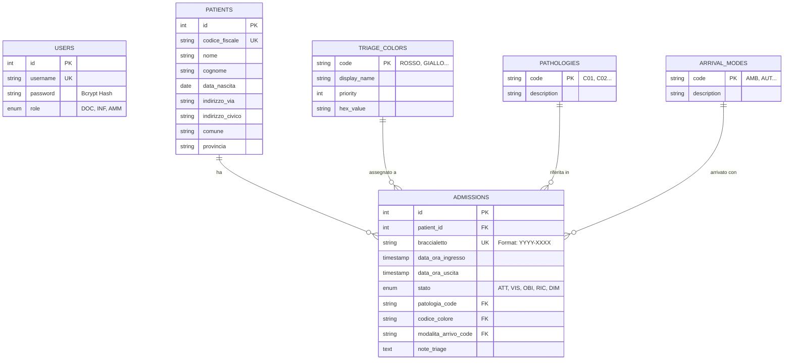

# 🗄️ SIO Database - Schema Reference

- **Database Engine:** PostgreSQL 16+
- **Schema:** `sio`
- **Encoding:** UTF-8
---

## 1. Entity-Relationship Diagram (ERD)
Di seguito la rappresentazione visiva delle relazioni tra le tabelle.

---

## 2. Tipi Enumerati (ENUMs)
Questi tipi personalizzati sono definiti a livello di database per garantire l'integrità dei dati.

### `user_role`
Definisce i permessi degli operatori sanitari.

| Valore  | Descrizione                              |
|:--------|:-----------------------------------------|
| `'DOC'` | Medico (Accesso completo)                |
| `'INF'` | Infermiere (Triage e gestione)           |
| `'AMM'` | Amministrativo (Solo lettura/Anagrafica) |

### `admission_status`

Definisce il flusso del paziente all'interno del Pronto Soccorso.

| Valore  | Descrizione  | Logica                                                    |
|:--------|:-------------|:----------------------------------------------------------|
| `'ATT'` | Attesa       | Il paziente è in sala d'attesa post-triage.               |
| `'VIS'` | Visita       | Il paziente è preso in carico dal medico.                 |
| `'OBI'` | Osservazione | Osservazione Breve Intensiva.                             |
| `'RIC'` | Ricovero     | Paziente trasferito in reparto (Esce dalla lista attiva). |
| `'DIM'` | Dimissione   | Paziente mandato a casa (Esce dalla lista attiva).        |
---

## 3. Tabelle Operative
### `admissions` (Accessi)
Questa è la tabella centrale del sistema. Collega il paziente clinico con l'evento amministrativo dell'accesso in PS.

| Colonna                | Tipo        | Vincoli                   | Descrizione                                |
|------------------------|-------------|---------------------------|--------------------------------------------|
| `id`                   | SERIAL      | **PK**                    | Identificativo univoco record.             |
| `patient_id`           | INTEGER     | **FK** -> `patients(id)`  | Riferimento al paziente.                   |
| `braccialetto`         | VARCHAR(20) | **UNIQUE**                | Codice univoco generato (es. `2024-0001`). |
| `data_ora_ingresso`    | TIMESTAMP   | DEFAULT NOW()             | Momento del triage.                        |
| `stato`                | ENUM        | DEFAULT 'ATT'             | Stato corrente (vedi sopra).               |
| `patologia_code`       | VARCHAR(10) | **FK** -> `pathologies`   | Codice patologia lamentata.                |
| `codice_colore`        | VARCHAR(20) | **FK** -> `triage_colors` | Codice priorità assegnata.                 |
| `modalita_arrivo_code` | VARCHAR(10) | **FK** -> `arrival_modes` | Mezzo di arrivo.                           |
| `note_triage`          | TEXT        | NULLABLE                  | Note libere inserite dall'infermiere.      |

### `patients` (Anagrafica Pazienti)
Contiene i dati anagrafici puri. Se un paziente torna, non viene creato un nuovo record qui, ma solo un nuovo record in `admissions`.

| Colonna          | Tipo         | Vincoli    | Descrizione                                  |
|------------------|--------------|------------|----------------------------------------------|
| `id`             | SERIAL       | **PK**     | ID interno.                                  |
| `codice_fiscale` | VARCHAR(16)  | **UNIQUE** | Chiave naturale per identificazione.         |
| `nome`           | VARCHAR(100) | NOT NULL   |                                              |
| `cognome`        | VARCHAR(100) | NOT NULL   |                                              |
| `data_nascita`   | DATE         | NOT NULL   | Usato per calcolo età pediatrica.            |
| `indirizzo...`   | VARCHAR      | NULLABLE   | Campi indirizzo (via, civico, comune, prov). |

---

## 4. Tabelle di Configurazione (Lookup)
Queste tabelle ("Dizionari") servono a popolare le select nel frontend e mantenere integrità referenziale. I codici (`code`) sono stringhe parlanti (es. 'ROSSO') invece di ID numerici per facilitare il debug.

### `triage_colors`

| Colonna        | Tipo        | Descrizione                                  |
|----------------|-------------|----------------------------------------------|
| `code`         | VARCHAR(20) | **PK** (es. 'ROSSO', 'GIALLO').              |
| `display_name` | VARCHAR(50) | Nome visualizzato (es. 'Emergenza').         |
| `priority`     | INTEGER     | Usato per l'ordinamento in lista (1 = Alto). |
| `hex_value`    | VARCHAR(7)  | Colore esadecimale per UI (es. '#FF0000').   |

### `pathologies`

| Colonna       | Tipo         | Descrizione                     |
|---------------|--------------|---------------------------------|
| `code`        | VARCHAR(10)  | **PK** (es. 'C01').             |
| `description` | VARCHAR(255) | Descrizione (es. 'Traumatica'). |

### `arrival_modes`

| Colonna       | Tipo         | Descrizione                        |
|---------------|--------------|------------------------------------|
| `code`        | VARCHAR(10)  | **PK** (es. 'AMB').                |
| `description` | VARCHAR(255) | Descrizione (es. 'Ambulanza 118'). |

---

## 5. Sicurezza e Utenti

### `users`
Tabella per l'accesso del personale ospedaliero.

| Colonna    | Tipo         | Descrizione                                 |
|------------|--------------|---------------------------------------------|
| `id`       | SERIAL       | **PK**                                      |
| `username` | VARCHAR(50)  | **UNIQUE** Username di login.               |
| `password` | VARCHAR(255) | Hash crittografato (Bcrypt). Mai in chiaro. |
| `role`     | ENUM         | Ruolo per autorizzazioni API (`user_role`). |

---

## Note di Progettazione

1. **Unique Constraint (Upsert):** La tabella `patients` ha un vincolo UNIQUE sul `codice_fiscale`. L'API gestisce l'inserimento con logica `ON CONFLICT DO UPDATE`, permettendo di aggiornare i dati di un paziente esistente durante un nuovo triage senza creare duplicati.
2. **Date vs Timestamp:** Per la data di nascita usiamo `DATE` (senza orario), per ingresso/uscita usiamo `TIMESTAMP` (con orario) in UTC.
