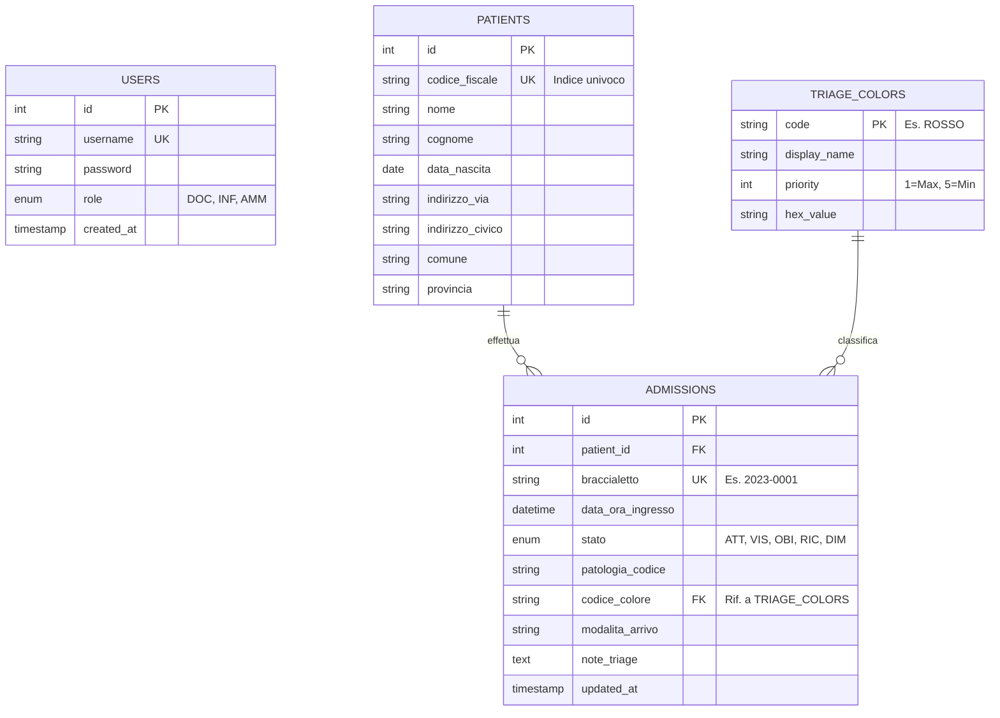

# Diagramma ER del database per il sistema di gestione del pronto soccorso
Questo diagramma rappresenta le tabelle principali e le loro relazioni nel database PostgreSQL utilizzato dal sistema di gestione del pronto soccorso.

### Legenda delle Relazioni

1. **PATIENTS `1` -- `N` ADMISSIONS**
    - **Relazione:** Uno a Molti.
    - **Logica:** Un singolo paziente (identificato univocamente dal CF) può tornare al Pronto Soccorso più volte nel corso della sua vita. La tabella `admissions` tiene traccia dello storico di tutti questi accessi collegandoli allo stesso record anagrafico.
2. **TRIAGE_COLORS `1` -- `N` ADMISSIONS**
    - **Relazione:** Uno a Molti.
    - **Logica:** Il colore "ROSSO" (definito una sola volta in `triage_colors` con il suo esadecimale e priorità) può essere assegnato a infiniti accessi diversi. Se un domani decidi di cambiare l'esadecimale del rosso, lo cambi in un solo posto (`TRIAGE_COLORS`) e si aggiorna per tutti.
3. **USERS**
    - È un'entità "isolata" a livello di schema relazionale stretto (non ci sono Foreign Key che puntano a `users`), ma è fondamentale a livello applicativo per l'autenticazione e i permessi (Role-Based Access Control).
